# 旅行邮箱 — 产品使用及设计说明手册

> 版本：v1.0.0  
> 更新日期：2026-05-18  
> 产品定位：一款以邮政明信片为主题的旅行记录 H5 应用

---

## 一、产品概述

**旅行邮箱**是一款以邮政明信片为核心载体的旅行记录应用。用户通过创建「旅程」，在旅途中拍摄照片、记录心情，将每一段经历封装为一张独特的「明信片」。明信片可收藏、可寄送（给未来的自己或通讯录好友），并在地图与时间轴中形成可视化的旅行足迹。

### 1.1 产品理念

- **邮政美学**：以传统邮政信封、邮票、邮戳为视觉符号，营造复古而温暖的旅行仪式感。
- **旅程归档**：每张明信片都必须归属到一段「旅程」中，形成结构化的旅行记忆。
- **社交寄送**：支持将明信片寄送给通讯录好友，分享旅途中的美好瞬间。

### 1.2 平台支持

| 平台 | 说明 |
|------|------|
| **H5 网页** | 线上地址：http://115.190.7.207 |
| **Android App** | [GitHub Release 下载](https://github.com/llmlearning-x/Postcards/releases/download/v1.0.0/default.apk) |
| **产品手册** | [GitHub Pages](https://llmlearning-x.github.io/Postcards/) |
| **GitHub 仓库** | https://github.com/llmlearning-x/Postcards |

### 1.3 目标用户

- 热爱旅行、喜欢用图文记录旅途的年轻人
- 追求仪式感、喜欢复古/文艺风格的用户
- 希望以结构化方式管理旅行回忆的用户

---

## 二、整体功能架构

```
┌─────────────────────────────────────────────────────────────┐
│                        旅行邮箱 v1.0.0                        │
├─────────────────────────────────────────────────────────────┤
│  用户体系                                                     │
│  ├── 注册（邮箱号 CN-XXXXXX + 密码）                           │
│  ├── 登录                                                     │
│  └── 个人资料（昵称、头像、积分、统计）                          │
├─────────────────────────────────────────────────────────────┤
│  核心功能                                                     │
│  ├── 首页（公告栏、快捷入口）                                   │
│  ├── 时间轴（按日期倒序展示明信片）                              │
│  ├── 记录（创建明信片：照片+位置+城市+心情+邮票）                  │
│  ├── 地图（旅行足迹可视化：国家/城市/明信片/旅程统计）              │
│  └── 我的（个人中心、设置、关于）                                │
├─────────────────────────────────────────────────────────────┤
│  社交功能                                                     │
│  ├── 通讯录（好友列表）                                        │
│  ├── 收件箱（收到的好友明信片）                                 │
│  └── 寄出（发送明信片给好友/自己）                               │
├─────────────────────────────────────────────────────────────┤
│  增值系统                                                     │
│  ├── 邮票商店（解锁主题邮票：经典/自然/文化/城市/古迹/四季…）       │
│  ├── 积分系统（注册/签到/记录明信片/寄出 获得积分）                │
│  └── 收藏（邮票集、明信片集）                                   │
├─────────────────────────────────────────────────────────────┤
│  旅程管理                                                     │
│  ├── 创建旅程（设定出发地与目的地）                               │
│  ├── 旅程列表（Boarding Pass 风格卡片）                         │
│  └── 旅程归档（明信片自动归属）                                  │
└─────────────────────────────────────────────────────────────┘
```

---

## 三、使用指南

### 3.1 注册与登录

#### 注册流程

首次使用需创建「旅行信箱」，系统会分配唯一的邮箱号（格式：`CN-XXXXXX`）。

1. 点击「立即注册」进入注册页
2. 输入旅行昵称
3. 设置 6 位数字密码
4. 点击「投递申请」完成注册
5. 系统会自动分配邮箱号并登录

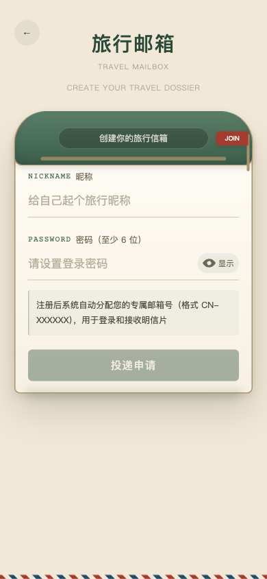

#### 登录流程

已注册用户可通过邮箱号和密码登录。

1. 输入 6 位邮箱号（系统自动补全 `CN-` 前缀）
2. 输入密码
3. 点击「开启信箱」登录

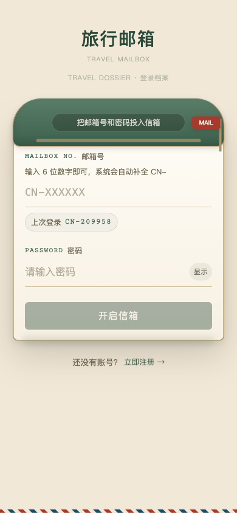

---

### 3.2 首页

首页是用户进入应用后的主界面，采用双栏瀑布流布局展示「旅行公告栏」中的公开明信片。

#### 页面结构

| 区域 | 说明 |
|------|------|
| **顶部栏** | 显示当前时间、用户昵称、日期 |
| **今日卡片** | 引导创建第一段旅程，快捷入口 |
| **快捷导航** | 收件箱 / 寄出 / 通讯录 三个功能入口 |
| **旅行公告栏** | 双栏瀑布流展示公开明信片（含城市标签、点赞数、作者邮箱号） |
| **底部引导** | 未创建旅程时显示「创建第一段旅程」引导 |
| **底部 Tab** | 首页 / 时间轴 / 记录 / 地图 / 我的 |

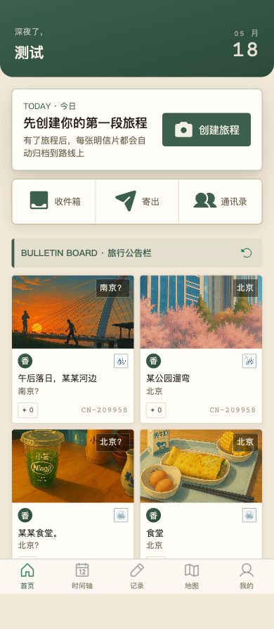

#### 公告栏明信片卡片

每张明信片卡片包含：
- 顶部城市标签（如「北京」「南京？」）
- 封面图片
- 类型标签（香/番 等，代表不同的内容分类）
- 标题（如「午后落日，某某河边」）
- 底部：点赞数 + 作者邮箱号（如 `CN-209958`）

---

### 3.3 时间轴

时间轴按日期倒序展示用户创建的所有明信片，形成线性的旅行回忆时间线。每条记录按日期分组，包含明信片缩略图、标题、城市、日期。


---

### 3.4 记录明信片

「记录」是产品的核心功能，用于创建一张新的旅行明信片。

#### 创建流程

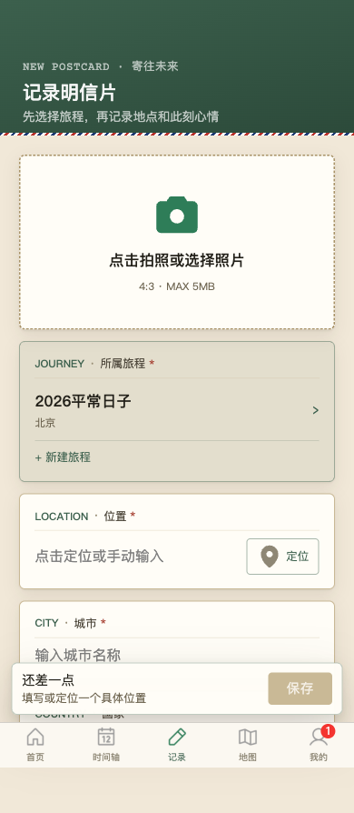

| 步骤 | 字段 | 说明 |
|------|------|------|
| 1 | **照片** | 点击拍照或从相册选择，比例 4:3，最大 5MB |
| 2 | **所属旅程** | 选择已有旅程，或点击「+ 新建旅程」创建 |
| 3 | **位置** | 点击定位按钮自动获取，或手动输入具体地址 |
| 4 | **城市** | 输入城市名称（必填） |
| 5 | **国家** | 默认「中国」，可修改 |
| 6 | **收件人** | 选填，默认「未来的我」，可写给通讯录好友 |
| 7 | **备注** | 记录此刻的心情，最多 200 字 |
| 8 | **邮票** | 默认使用当前邮票，点击「更换」可选择其他已解锁邮票 |
| 9 | **预览** | 点击「查看」可预览明信片正反面效果 |
| 10 | **保存** | 填写完整后点击「保存明信片」完成创建 |

#### 表单验证

- 位置、城市为必填项
- 未填写完整时，底部提示「还差一点」，保存按钮置灰

---

### 3.5 地图

地图页以可视化方式展示用户的旅行足迹。顶部统计国家数、城市数、明信片数与旅程数，中部足迹图标记已到访城市，底部列表展示到访城市与对应明信片数量。

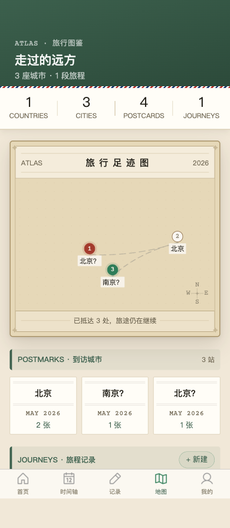

---

### 3.6 个人中心（我的）

个人中心汇总展示用户的个人信息、资产、社交入口和设置。

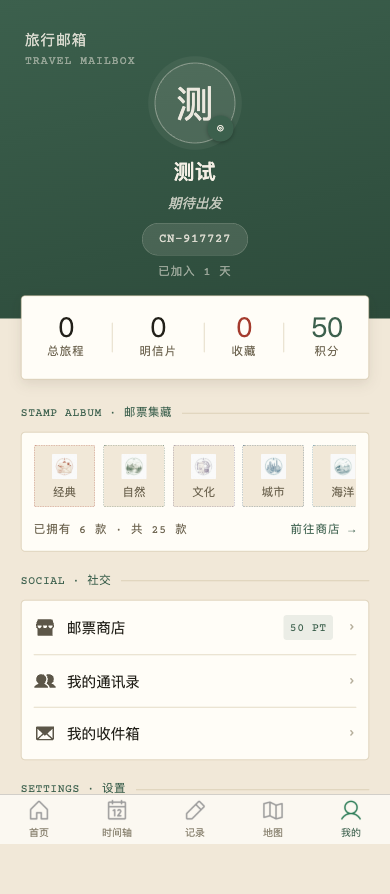

#### 页面结构

| 区域 | 说明 |
|------|------|
| **头像昵称区** | 头像、昵称、状态签名（如「期待出发」）、邮箱号、加入天数 |
| **数据统计** | 总旅程 / 明信片 / 收藏 / 积分 |
| **邮票集藏** | 横向滚动展示已解锁的邮票（经典、自然、文化、城市等） |
| **社交入口** | 邮票商店 / 我的通讯录 / 我的收件箱 |
| **设置** | 修改头像 / 编辑昵称 / 退出登录 |
| **关于** | 隐私协议 / 用户协议 / 关于我们 |
| **版本信息** | 旅行邮箱 · v1.0.0 |

---

### 3.7 邮票商店与预览

邮票商店提供多种主题的虚拟邮票，用户可用积分解锁，用于装饰明信片。点击任意邮票可进入全屏预览，查看设计理念与插画细节。

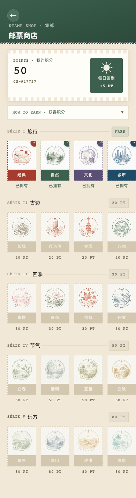

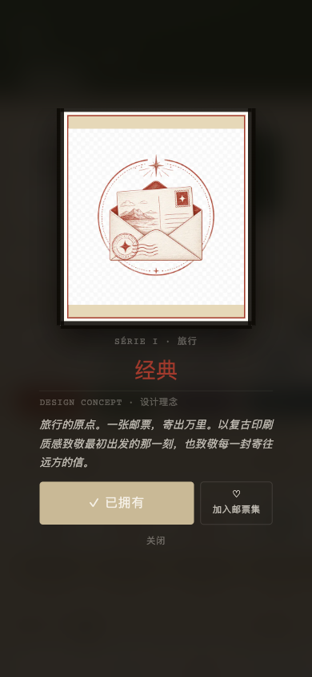

#### 邮票系列

| 系列 | 主题 | 积分 |
|------|------|------|
| SÉRIE I 旅行 | 经典、自然、文化、城市 | 免费 |
| SÉRIE II 古迹 | 长城、兵马俑、古塔、苏园 | 20 PT |
| SÉRIE III 四季 | 春樱、夏荷、秋枫、冬雪 | 30 PT |
| SÉRIE IV 节气 | 立春、清明、夏至、立秋、霜降、大寒 | 50 PT |
| SÉRIE V 远方 | 草原、雪山、沙漠、海岛 | 80 PT |

#### 积分获取

| 行为 | 积分 |
|------|------|
| 注册奖励 | +50 PT |
| 每日签到 | +5 PT |
| 记录明信片 | +10 PT |

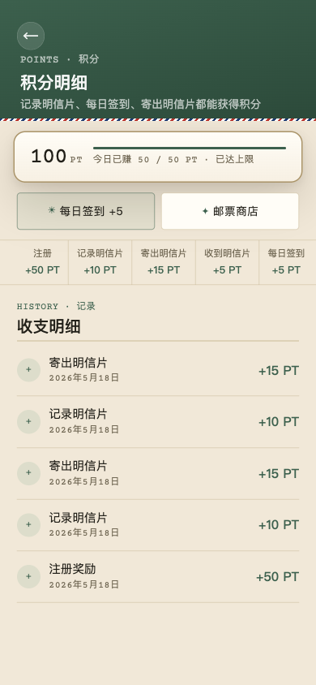

---

### 3.8 通讯录

通讯录管理好友关系，可查看已添加的联系人。


#### 功能

- 查看好友列表（显示昵称、邮箱号、状态签名）
- 点击好友可查看其个人主页
- 发送明信片给指定好友

---

### 3.9 收件箱与寄出

#### 收件箱

展示收到的好友明信片，支持「来信」与「已寄出」两个标签切换。

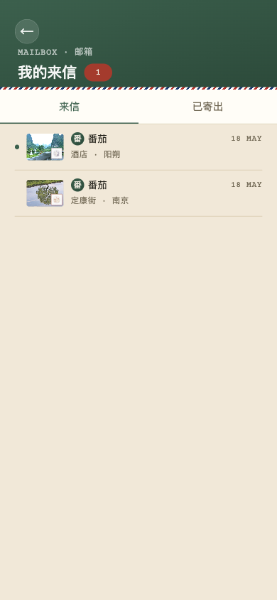

#### 寄出

选择已创建的明信片，寄送给通讯录好友或自己。

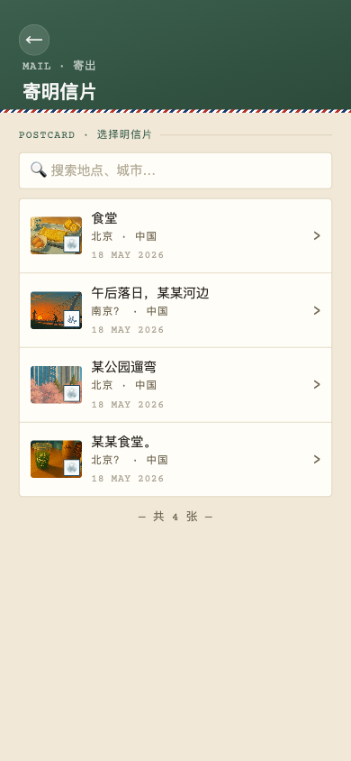

#### 明信片详情（收到）

点击收件箱中的明信片可查看详情，包含寄件人信息、明信片正面与背面内容。

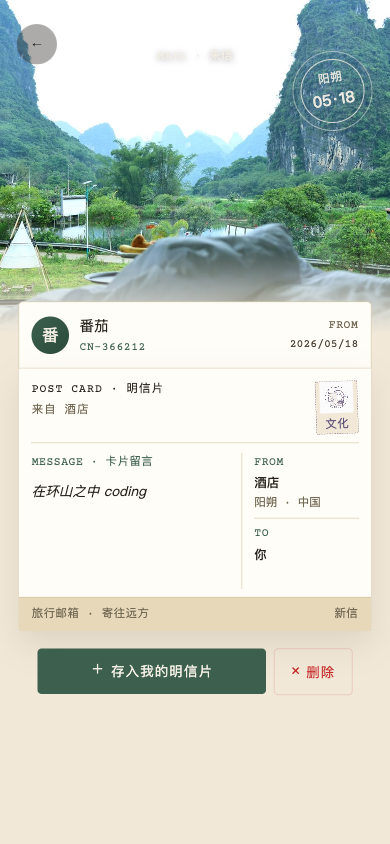

---

### 3.10 旅程管理

旅程是明信片的上级组织单位，一段旅程可包含多张明信片。

#### 创建旅程

1. 设定旅程名称
2. 选择出发地
3. 选择目的地
4. 设定出发日期

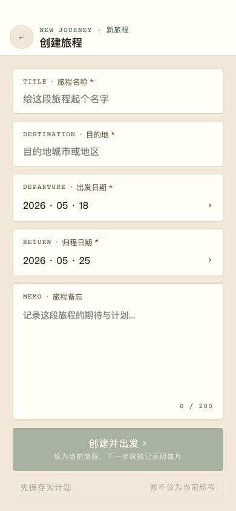

#### 旅程列表

以「登机牌（Boarding Pass）」风格展示所有旅程，包含：
- 出发地 → 目的地
- 旅程状态（进行中 / 已结束）
- 包含的明信片数量

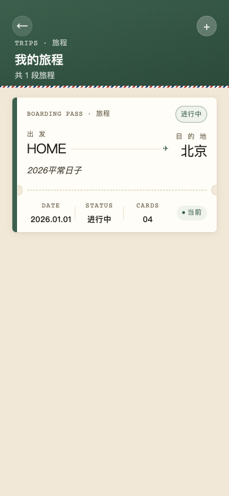

---

### 3.11 我的明信片与收藏

#### 我的明信片

列表展示用户创建的所有明信片，包含：
- 明信片编号（如 No.004）
- 城市与日期
- 封面缩略图
- 收件人信息
- 标题与内容摘要

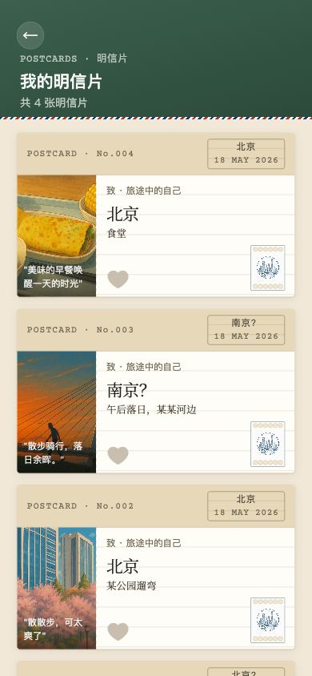

#### 明信片翻转预览

在「我的明信片」中点击任意卡片，即可唤起 3D 翻转预览。正面展示旅途照片与邮戳，背面呈现留言、收件地址与邮票，轻点即可翻面。

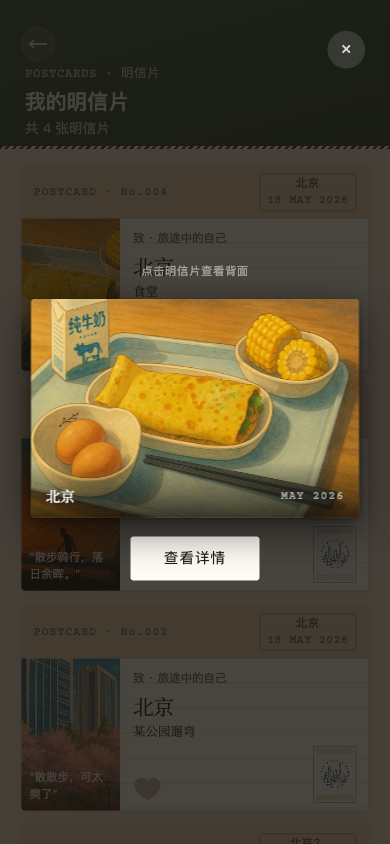

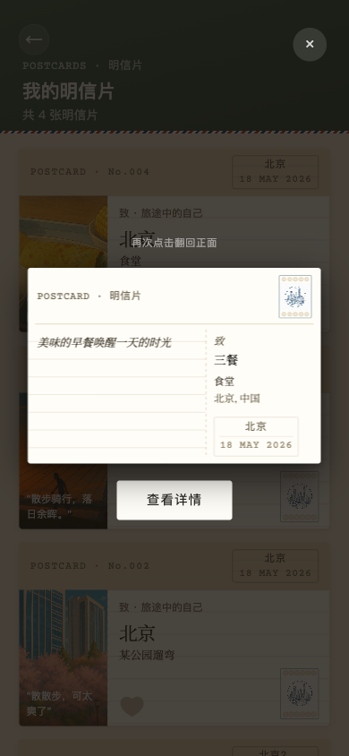

#### 明信片详情页

点击「查看详情」进入完整详情页，支持收藏、编辑、寄出、分享等操作。

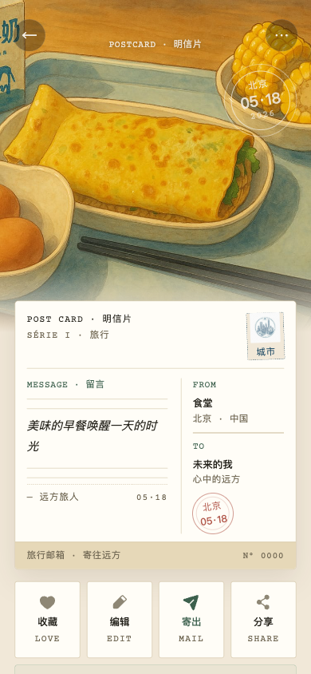

#### 收藏

- 明信片集：收藏的他人明信片
- 邮票集：收藏的已解锁邮票
- 增值服务：印成实体册（将明信片集冲印为精美纸质版）

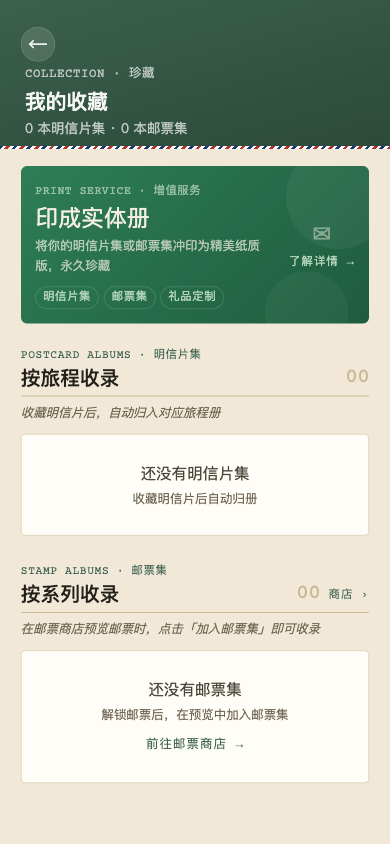

#### 编辑明信片

支持编辑已寄出的明信片信息，修改不会改变原始记录时间。

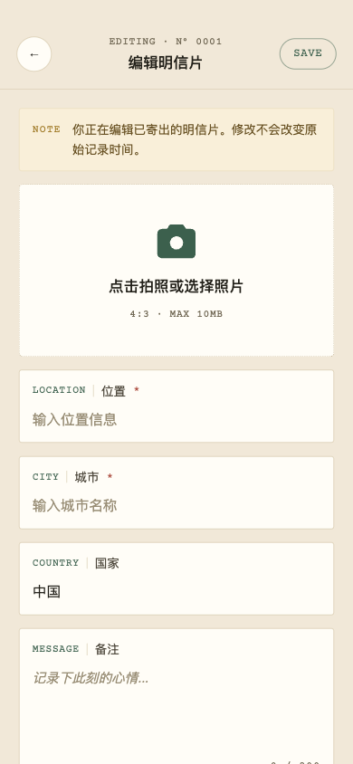

#### 旅行公告栏

独立的公告栏页面，展示所有公开分享的明信片，支持双栏瀑布流浏览。

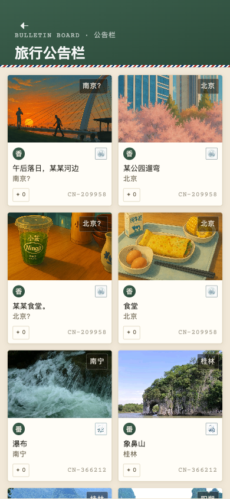

---

## 四、设计说明

### 4.1 视觉风格

#### 色彩体系

| 色彩角色 | 色值 | 用途 |
|----------|------|------|
| 主色（邮政绿） | `#2D5A45` | 顶部导航、按钮、标签、强调文字 |
| 背景色（米白） | `#F5F0E8` | 页面背景、卡片底色 |
| 文字主色 | `#333333` | 标题、正文 |
| 文字次色 | `#888888` | 辅助说明、时间、次要信息 |
| 边框/分割线 | `#E0DCD4` | 卡片边框、分隔线 |
| 点缀色（红） | `#C0392B` | 邮戳、积分标签、重要提示 |

#### 字体规范

- **标题**：思源宋体 / 衬线体，营造文艺复古感
- **正文**：系统默认无衬线字体，保证可读性
- **英文标签**：全部大写，字母间距加宽（如 `TRAVEL MAILBOX`、`BULLETIN BOARD`）

#### 视觉元素

- **信封边框**：顶部红蓝相间的锯齿纹，模拟航空信封
- **邮票样式**：圆角矩形，带齿孔边框，复古插画风格
- **邮戳标记**：圆形邮戳样式，用于标记城市、日期
- **Boarding Pass**：旅程卡片采用登机牌设计，带撕裂线效果

### 4.2 交互设计

#### 底部 Tab 导航

```
┌────────┬────────┬────────┬────────┬────────┐
│  首页   │ 时间轴  │  记录   │  地图   │  我的   │
│  🏠    │  📅    │  ✏️    │  🗺️   │  👤   │
└────────┴────────┴────────┴────────┴────────┘
```

- 选中状态：图标 + 文字高亮（邮政绿）
- 未选中状态：灰色图标 + 文字
- 「记录」Tab 带特殊强调（中间凸起或笔形图标）

#### 页面转场

- 页面切换：淡入淡出或从右向左滑动
- 返回上一级：从左向右滑动，带返回箭头 `<`

#### 弹窗规范

- 确认弹窗：居中显示，半透明遮罩，圆角矩形
- 底部操作弹窗：从底部滑出，用于选择旅程、邮票等

### 4.3 页面布局

#### 统一头部

所有子页面采用统一的顶部导航栏：
- 左侧：返回按钮（`<`）
- 中间：页面标题（中文 + 英文小标题）
- 右侧：操作按钮（如分享、更多）

#### 卡片布局

- 圆角：8-12px
- 阴影：轻微投影（`box-shadow: 0 2px 8px rgba(0,0,0,0.06)`）
- 内边距：16-20px
- 边框：1px 实线或虚线（模拟信封边缘）

#### 列表布局

- 时间轴/明信片列表：纵向单列或双列瀑布流
- 通讯录/旅程列表：左对齐，带头像/缩略图

---

## 五、附录

### 5.1 截图清单

| 编号 | 文件名 | 页面说明 |
|------|--------|----------|
| 1 | `01-landing.png` | 首页 |
| 2 | `02-profile.png` | 个人中心 |
| 3 | `03-timeline.png` | 时间轴（4 张明信片） |
| 4 | `05-map.png` | 地图（3 座城市） |
| 5 | `06-inbox.png` | 收件箱（有内容） |
| 6 | `09-travel.png` | 旅程管理 |
| 7 | `10-detail.png` | 明信片详情页 |
| 8 | `11-shop.png` | 邮票商店 |
| 9 | `13-login.png` | 登录页 |
| 10 | `14-register.png` | 注册页 |
| 11 | `15-record-logged.png` | 记录明信片 |
| 12 | `16-contacts-logged.png` | 通讯录 |
| 13 | `17-send-postcard.png` | 寄出明信片 |
| 14 | `18-my-postcards.png` | 我的明信片 |
| 15 | `19-travels.png` | 旅程列表 |
| 16 | `20-collection.png` | 收藏页 |
| 17 | `21-points.png` | 积分明细 |
| 18 | `22-edit.png` | 编辑明信片 |
| 19 | `23-maildetail.png` | 收件详情 |
| 20 | `24-board.png` | 旅行公告栏 |
| 21 | `25-stamp-preview.png` | 邮票全屏预览 |
| 22 | `26-postcard-front.png` | 明信片翻转预览 — 正面 |
| 23 | `27-postcard-back.png` | 明信片翻转预览 — 背面 |

### 5.2 更新日志

| 日期 | 版本 | 更新内容 |
|------|------|----------|
| 2026-05-18 | v1.0.0 | 初始版本，完成核心功能：注册登录、首页、记录、时间轴、地图、个人中心、邮票商店、通讯录、旅程管理 |

---

> **相关链接**：
> - H5 生产环境：http://115.190.7.207
> - GitHub Release：[v1.0.0](https://github.com/llmlearning-x/Postcards/releases/tag/v1.0.0)
> - APK 下载：[旅行邮箱.apk](https://github.com/llmlearning-x/Postcards/releases/download/v1.0.0/default.apk)
> - GitHub 仓库：[llmlearning-x/Postcards](https://github.com/llmlearning-x/Postcards)
> 
> **文档说明**：本手册基于线上 H5 环境实际截图与功能体验整理，涵盖产品功能架构、使用指南与设计说明，供产品、设计与开发人员参考。
